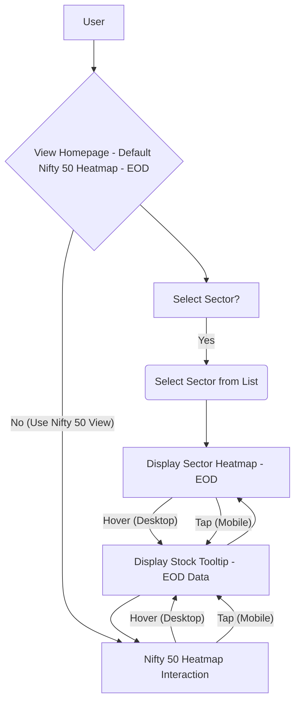

# Product Requirements Document: Visual Market Pulse Dashboard (Frontend) - v1.8

**Version:** 1.8
**Date:** 2025-05-11
**Status:** Updated Draft

## 1. Introduction

This document outlines the frontend requirements for the Visual Market Pulse Dashboard, a web application designed to provide users (particularly those seeking a quick, long-term perspective) with an intuitive, visualization-driven overview of the Indian stock market. For the MVP, this includes the Nifty 50 index and key market sectors. The core philosophy emphasizes minimal text, direct interaction with visual elements, and rapid comprehension of market state and trends using End-of-Day (EOD) data. Data is sourced via backend APIs, which in turn use Yahoo Finance (`yfinance`) exclusively for **daily (1D) EOD** historical technical data. This PRD focuses exclusively on the client-side/frontend components and interactions.

### 1.1 Problem Definition & Context

The Indian stock market sees increasing participation from retail investors who often face challenges in accessing clear, actionable information and tools to navigate market complexities efficiently using End-of-Day (EOD) data. This can lead to suboptimal investment decisions, missed opportunities, and increased anxiety, especially for newer participants or those with limited time. Many individuals juggle trading/investing with full-time jobs or other commitments, highlighting a critical need for efficient and time-saving solutions for EOD analysis.

**Specific Pain Points Addressed:**
*   **Information Overload:** Existing platforms can be cluttered with excessive data, real-time noise, and complex charting tools, making it difficult to get a quick EOD "pulse."
*   **Time Consuming Analysis:** Sifting through tables, news, and detailed charts to understand daily EOD market and sector performance can take significant time.
*   **Difficulty in Spotting Trends:** Identifying which sectors are leading or lagging, or understanding the breadth of market movement (e.g., is a Nifty 50 rise broad-based or driven by a few stocks?) is not always straightforward from traditional EOD reports.
*   **Lack of Visual Clarity:** Many tools prioritize numerical data over intuitive visual summaries, hindering rapid comprehension, especially for EOD trend assessment.

**Why Solving This Matters:**
*   **Empowers Investors:** Provides users with a tool to quickly understand EOD market dynamics, enabling more informed, less stressful decision-making.
*   **Saves Time:** Caters to busy individuals by offering a rapid visual assessment of EOD market and sector health.
*   **Improves Market Understanding:** Helps users develop a better intuition for market behavior and sector rotations through consistent EOD visual feedback.

**Differentiation:**
The Visual Market Pulse Dashboard differentiates itself by focusing *exclusively* on EOD data visualization for quick trend assessment, emphasizing:
*   **Visual-First Approach:** Prioritizing heatmaps and color-coding over dense text or complex charts for EOD data.
*   **Speed to Insight:** Designed for users to grasp the EOD market and sector state in under a minute.
*   **Sector-Level EOD Focus:** Providing clear visual breakdowns of EOD performance within key market sectors, not just the overall index.
*   **Minimalism:** A clean, uncluttered interface that avoids overwhelming the user.

### 1.2 Business Goals & Success Metrics

* **Goal 1:** Achieve 100 registered users within the first 6 months post-launch.
    * **Metric:** Number of registered users.
* **Goal 2:** Attain an average session duration of 2.5 minutes within the first 3 months (increased due to sector views).
    * **Metric:** Average session duration.
* **Goal 3:** Gather qualitative feedback from at least 20 users within the first 2 months post-launch to inform iterative development.
    * **Metric:** Number of user feedback submissions (e.g., survey responses, direct feedback).
* **Goal 4 (User Adoption):** 50 users actively use the heatmap feature (overall and/or sector-specific) at least once a week within the first 3 months.
    * **Metric:** Weekly active users of heatmap features.
* **Goal 5 (Sector Feature Adoption):** At least 30% of active users engage with the sector selection feature within the first 3 months.
    * **Metric:** Percentage of weekly active users using the sector view.

### 1.3 User Research & Insights

While formal user research is planned for future iterations, initial assumptions are based on the understanding that Indian traders and investors, particularly those with a long-term perspective using EOD data, need:
*   A quick, digestible, and visual overview of daily market performance (EOD).
*   The ability to understand EOD performance at a **sector level** to identify broader trends or isolated sector movements without deep dives.
*   Visual cues (like color intensity and size) that immediately convey the magnitude and significance of EOD changes without requiring detailed reading or complex chart interpretation.
*   A way to reduce the "noise" of intraday fluctuations and focus on the settled EOD picture for trend analysis.

*Target User Persona (Initial):*
*   **Name:** Priya Sharma
*   **Age:** 30-45
*   **Occupation:** Salaried Professional
*   **Investing Style:** Long-term investor, primarily in blue-chip stocks and index funds, with some interest in sector-specific ETFs or stocks. Uses EOD data for review and planning.
*   **Needs:**
    *   Wants a quick (<1 minute) way to check EOD market status (Nifty 50).
    *   Needs to understand which sectors are performing well or poorly at EOD without sifting through complex charts or news.
    *   Interested in identifying major EOD movements in key indices and sectors visually.
    *   Values visual summaries that save time and reduce cognitive load for EOD analysis.
    *   Prefers a clean, uncluttered interface.
*   **Pain Points:**
    *   Finds most financial platforms overwhelming with too much data and real-time information when she only needs an EOD summary.
    *   Doesn't have time for in-depth daily analysis but wants to stay informed about EOD trends at market and sector levels.
    *   Struggles to quickly identify significant EOD movers and sector performance from text-heavy data tables or generic EOD reports.
    *   Feels current tools don't cater well to a quick visual "pulse check" of EOD market health.

## 2. Goals (Product Specific)

*   Provide a highly scannable (< 30 seconds for initial overview), visual overview of market health (Nifty 50) and **key market sector EOD performance**.
*   Enable intuitive access to EOD information for specific indices, **sectors**, and individual stocks through direct interaction with visualizations, based on **EOD data**.
*   Deliver a clean, minimalist, and responsive user experience across desktop and mobile devices using **Alpine.js and Bootstrap**.
*   Ensure rapid comprehension of stock/index/sector EOD performance through consistent color-coding (red/green) based on a defined **linear intensity mapping**.
*   Enable quick assessment of EOD performance across different market sectors.
*   Ensure that the visual representation of EOD data (color, size) is immediately understandable and requires minimal cognitive load.

## 3. MVP Scope Definition

### 3.1 Core Functionality (MVP)

*   **FEAT-001: Homepage Market/Index Heatmap (EOD Data)**
    *   **User Story:** As a long-term investor, I want to see a visual grid of Nifty 50 stocks (default view), color-coded by their daily EOD percentage change and sized by market capitalization, so that I can quickly assess the overall market sentiment and identify significant EOD movers at a glance.
*   **FEAT-015: Sector Selection & Heatmap View (EOD Data)**
    *   **User Story:** As a long-term investor, I want to select a market sector (e.g., Nifty Bank, Nifty IT) and view a heatmap of its constituent stocks based on their EOD performance and market cap, so that I can understand which sectors are driving market movements and identify EOD performing stocks within a specific sector.
*   **FEAT-002: Stock Tile Tooltip & Basic Info (EOD Data)**
    *   **User Story:** As a user scanning a heatmap (market or sector), I want to hover/tap on a stock tile to see its name, daily EOD percentage change, and daily EOD volume change, so that I can get quick details without navigating away from the visual overview.
*   **FEAT-010: Responsive Design (Alpine.js & Bootstrap)**
    *   **User Story:** As a user, I want the dashboard to be easily viewable and usable on my desktop or mobile device, so that I can check market and sector EOD data conveniently anytime, anywhere.
*   **FEAT-011: Consistent Color Coding & Legend (EOD Data)**
    *   **User Story:** As a user, I want to instantly understand if an EOD stock movement (in any heatmap) is positive or negative and its relative magnitude through consistent red/green color coding with varying intensity, and I want a clear legend explaining this color scale, so that I can quickly and accurately interpret the visualizations.

**Basic User Flow Diagram (MVP):**

### 3.2 Scope Boundaries

**OUT of Scope for MVP:**
*   Real-time data or intraday chart updates.
*   User accounts or authentication.
*   Portfolio tracking.
*   Watchlist functionality.
*   News integration.
*   Any form of historical price charts for individual stocks.
*   Advanced charting features (e.g., technical indicators, candlestick charts).
*   Nifty Next 50 integration (Release 2).
*   Index Detail Pages showing Top Gainers/Losers (Release 2).
*   Overall Index Indicators on Homepage (Release 3).
*   Heatmap showing aggregated sector performance (MVP shows stocks *within* a sector, not sector-level aggregate tiles).
*   Complex layout algorithms beyond basic market cap weighting within the current view.
*   Handling of corporate actions (splits, dividends) in historical EOD data display (rely on yfinance output).

### 3.3 MVP Validation Approach
*   **Method:**
    *   Internal Alpha Testing: Conduct thorough testing with the internal team to identify major bugs and usability issues.
    *   Targeted Beta Program: Soft launch to a small, curated group of ~20-30 target users (matching Priya Sharma persona) for a 2-4 week period.
*   **Feedback Mechanisms:**
    *   In-app Feedback Form (Simple): A non-intrusive way for beta users to submit quick comments or bug reports.
    *   Online Surveys: Short, focused surveys sent to beta users post-interaction (e.g., after 1 week of use) covering ease of use, clarity of visualizations, utility of sector views, and overall satisfaction with EOD data presentation.
    *   Short User Interviews: Conduct 5-7 voluntary, brief (15-20 minute) interviews with engaged beta users to gather deeper qualitative insights and observe their interaction patterns.
*   **Criteria for Moving Beyond MVP:**
    *   **Qualitative Feedback:** Predominantly positive feedback on ease of use for EOD data assessment (market and sector views). Users confirm the visual cues (color, size) are effective for rapid understanding.
    *   **Task Completion:** At least 80% of beta users successfully complete core user flows without assistance (e.g., viewing Nifty 50, selecting a sector, viewing sector heatmap, accessing stock info via tooltips).
    *   **Understanding:** At least 75% of beta users demonstrate correct interpretation of the heatmap and color-coding for EOD data in survey responses or interviews.
    *   **Performance:** Key performance NFRs (NFR-01: load times) are met under typical usage conditions during beta.
    *   **Bug Rate:** Critical and major bug rate is low and manageable.
*   **Learning Goals for MVP:**
    *   Validate the core hypothesis: Is a visual-first, EOD heatmap an effective and preferred way for target users to get a quick market/sector pulse?
    *   Identify any major usability issues with the EOD data presentation, sector navigation, tooltip interaction (especially on mobile), and overall intuitiveness.
    *   Gauge the perceived value and utility of the sector-specific heatmaps.
    *   Assess the clarity and effectiveness of the chosen color gradient and market cap sizing for visual interpretation of EOD data.
    *   Uncover any unforeseen user needs or desired enhancements for future iterations.
    *   Identify any performance bottlenecks related to data fetching or frontend rendering, particularly for heatmaps with varying numbers of constituents.

## 4. Functional Requirements (Mapped to Features)

Features are prefixed with "FEAT-". Functional Requirements are prefixed with "FR-".

**FEAT-001: Homepage Market/Index Heatmap (EOD Data)**
*   **FR-1.1:** By default, display a grid representing stocks from Nifty 50 when the user first visits the page or selects an "Overall Market" view.
*   **FR-1.3:** Each stock shall be represented by a rectangular tile.
*   **FR-1.4:** Tile size must be weighted proportionally by the stock's Market Capitalization relative to other stocks currently displayed in the heatmap view. The visual difference in size should be clearly perceptible.
*   **FR-1.5:** Tile background color must be determined by the stock's Daily Percentage Change (EOD) (fetched from API).
    *   Definition: Daily Percentage Change = ((Current Day Close Price - Previous Day Close Price) / Previous Day Close Price) * 100%. Data reflects End-of-Day (EOD) values.
    *   Color mapping follows FR-11.3 using a defined linear gradient scale.
*   **FR-1.6:** Clicking/tapping a stock tile displays the tooltip (FEAT-002); no further navigation occurs from the tile itself in MVP.
*   **FR-1.7:** Display the stock's ticker symbol clearly on the tile. For smaller tiles where the symbol might be truncated or omitted due to space constraints, the tooltip (FEAT-002) must always provide the full name and ticker.
*   **Acceptance Criteria:**
    *   Given a user navigates to the homepage, then a heatmap of Nifty 50 stocks is displayed by default, with tiles sized by market cap and colored by EOD % change.
    *   Given the Nifty 50 heatmap is displayed, then each tile's size visually and proportionally corresponds to its market cap relative to other tiles in the Nifty 50.
    *   Given the Nifty 50 heatmap is displayed, then each tile's color accurately reflects its EOD daily percentage change according to the defined red/green linear scale and legend.
    *   Given the Nifty 50 heatmap is displayed, then the stock ticker symbol is visible on each tile where space allows without compromising readability.
    *   When a user clicks or taps a Nifty 50 stock tile, the tooltip (FEAT-002) is displayed or remains displayed with accurate stock information.
    *   For tiles below a defined minimum size threshold, the ticker symbol may be omitted from the tile itself, but the tooltip must always display it.

**FEAT-015: Sector Selection & Heatmap View (EOD Data)**
*   **FR-15.1:** Display a clear and easily accessible mechanism for sector selection (e.g., a dropdown list, a series of buttons) prominently on the page, likely near the main heatmap area. The list of sectors will be provided by the backend (e.g., Nifty Bank, Nifty IT, Nifty Auto, Nifty FMCG, Nifty Pharma - specific list TBD by backend, see Dependency D1).
*   **FR-15.2:** The sector selection mechanism must include an option to view the "Overall Market" (i.e., Nifty 50, as per FEAT-001), which is the default selected view.
*   **FR-15.3:** Upon selecting a sector, the main heatmap area must update dynamically to display only the constituent stocks of that selected sector. Loading states (NFR-07) should be shown during data fetch.
*   **FR-15.4:** Stocks within the sector-specific heatmap must adhere to the following display rules:
    *   Tiles sized by market capitalization. The weighting should be relative to other stocks within that specific sector's heatmap display.
    *   Tiles color-coded by EOD daily percentage change using the standard linear scale (FR-11.3) and legend.
    *   Display the stock's ticker symbol clearly on the tile (FR-1.7 applies).
*   **FR-15.5:** Each stock tile within the sector heatmap must provide tooltips on hover/tap as per FEAT-002.
*   **FR-15.6:** Clicking/tapping a stock tile within the sector heatmap displays the tooltip (FEAT-002); no further navigation occurs from the tile itself in MVP.
*   **FR-15.7:** The currently selected view (e.g., "Nifty 50" or "Nifty IT") should be clearly and unambiguously indicated to the user (e.g., a heading above the heatmap, highlighted state in the selector).
*   **Acceptance Criteria:**
    *   Given the user is on the homepage, then a list of selectable market sectors and an "Overall Market" (Nifty 50) option is visible, functional, and the "Overall Market" is selected by default.
    *   When the user selects a specific sector (e.g., "Nifty IT"), then the heatmap updates to show only stocks belonging to "Nifty IT", sized and colored appropriately for that sector's EOD data.
    *   Given a sector heatmap is displayed, then each tile's size visually and proportionally corresponds to its market cap relative to other stocks currently displayed in that sector's heatmap.
    *   Given a sector heatmap is displayed, then each tile's color accurately reflects its EOD daily percentage change according to the defined red/green linear scale and legend.
    *   Given a sector heatmap is displayed, then the stock ticker symbol is visible on each tile where space allows.
    *   When a user clicks or taps a stock tile within the sector heatmap, the tooltip (FEAT-002) is displayed or remains displayed with accurate stock information.
    *   The UI clearly and persistently indicates which view (Overall Market or specific sector) is currently active.
    *   For tiles below a defined minimum size threshold, the ticker symbol may be omitted from the tile itself, but the tooltip must always display it.

**FEAT-002: Stock Tile Tooltip & Basic Info (EOD Data) (Applies to tiles in both Nifty 50 and Sector heatmaps)**
*   **FR-2.1:** (Covered by FR-1.7) Display the stock's ticker symbol directly on the heatmap tile where space permits.
*   **FR-2.2:** On mouse hover over a stock tile (desktop) in any active heatmap, display a non-intrusive tooltip.
*   **FR-2.3:** On tap on a stock tile (mobile) in any active heatmap, display a clearly visible tooltip. The tooltip should be easily dismissible (e.g., tap outside).
*   **FR-2.4:** The tooltip must clearly display: Stock Name, Ticker Symbol, Daily Percentage Change (EOD), Daily Volume Change (EOD).
    *   Definition: Daily Volume Change = ((Current Day Volume - Previous Day Volume) / Previous Day Volume) * 100%. Data reflects EOD values.
*   **FR-2.5:** The tooltip must disappear when the mouse moves off the tile (desktop) or when the user taps outside the tooltip/tile area or on a dismiss control (mobile).
*   **FR-2.6:** Tooltip data should be fetched efficiently as part of the initial heatmap data load for the current view to ensure near-instantaneous display and avoid individual API requests per hover/tap.
*   **Acceptance Criteria:**
    *   Given any stock tile in an active heatmap, when a user hovers over it (desktop), then a tooltip appears showing the correct stock name, ticker, EOD daily % change, and EOD daily volume change.
    *   Given any stock tile in an active heatmap, when a user taps it (mobile), then a tooltip appears showing the correct stock name, ticker, EOD daily % change, and EOD daily volume change.
    *   Given the tooltip is visible, when the user moves the mouse off the tile (desktop) or taps outside the tooltip/tile area (mobile), then the tooltip disappears.
    *   Tooltip display is responsive and does not lag.

**FEAT-010: Responsive Design (Alpine.js & Bootstrap)**
*   **FR-10.1:** All pages and components (heatmaps, selectors, tooltips, legend) must render correctly and be fully usable on common screen widths (e.g., mobile: 360px-480px, tablet: 768px-1023px, desktop: 1024px+) using Bootstrap's grid system and responsive utilities, enhanced with Alpine.js for dynamic behaviors.
*   **FR-10.2:** Layout elements, especially heatmaps and sector selectors, must reflow or resize appropriately to fit the viewport. Heatmap tile sizing (FR-1.4, FR-15.4) must remain visually proportional based on market cap within the current view, adapting to available screen space while maintaining clarity.
*   **FR-10.3:** Interactions (click/tap targets for tiles and selectors, tooltip invocation and dismissal) must function correctly and feel natural on both touch and non-touch devices. Tap targets on mobile must be adequately sized.
*   **FR-10.4:** Styling must be achieved primarily using Bootstrap. Custom CSS should be minimal, well-organized, and only used for overrides or custom elements not covered by Bootstrap. Alpine.js will manage client-side interactivity and state for components like the active sector view, tooltip display logic, and dynamic content updates.
*   **Acceptance Criteria:**
    *   Given a user views the application on a mobile device, then the layout adjusts for the smaller screen, all text is legible, heatmap tiles are distinguishable, and all features (including sector selection, heatmap interaction with tap tooltips, legend) are fully usable and accessible.
    *   Given a user views the application on a tablet device, then the layout adapts appropriately.
    *   Given a user views the application on a desktop, then the layout utilizes the larger screen space effectively, displaying information clearly.
    *   Heatmap tile sizing remains visually proportional based on market cap relative to the current view, regardless of screen size, and tiles remain individually selectable.
    *   All interactive elements are easily operable on touchscreens.

**FEAT-011: Consistent Color Coding & Legend (EOD Data) (Applies to all heatmaps)**
*   **FR-11.1:** All representations of positive EOD change (gain %) in heatmaps must use shades of green.
*   **FR-11.2:** All representations of negative EOD change (loss %) in heatmaps must use shades of red.
*   **FR-11.3:** Color intensity must indicate the magnitude of EOD change based on a defined linear scale mapping percentage change to a color gradient. The scale must have clearly defined endpoints (e.g., darkest red for -X% or lower, darkest green for +Y% or higher, a neutral color for 0%). (Definition of specific gradient endpoints, neutral color, and intermediate steps TBD - See Dependency D2).
*   **FR-11.4:** Neutral states (0% EOD change) should use a distinct, clearly defined neutral color (e.g., light grey or off-white), which will be the midpoint of the linear gradient.
*   **FR-11.5:** A simple, clear, and always visible color legend must be displayed on any page containing a heatmap. The legend must explain the color intensity scale (e.g., showing a gradient bar with labels for min/max/neutral % change).
*   **Acceptance Criteria:**
    *   Given a stock has a positive EOD % change, then its representation (heatmap tile) is a shade of green, consistent with the legend.
    *   Given a stock has a negative EOD % change, then its representation is a shade of red, consistent with the legend.
    *   Given two stocks have different positive EOD % changes, then the stock with the larger absolute change has a visibly more intense green color, as per the defined linear scale and legend. Similar logic applies to negative changes and red intensity.
    *   A stock with 0% EOD change is displayed in the defined neutral color, as indicated in the legend.
    *   The color mapping is consistently applied across all heatmaps (Nifty 50 and sectors).
    *   A color legend explaining the linear intensity scale (mapping colors to % change ranges) is clearly visible and understandable on all heatmap pages.

## 5. Non-Functional Requirements

*   **NFR-01: Performance:**
    *   The application should load key EOD market data for the default (Nifty 50) heatmap within 3-4 seconds on a standard internet connection (e.g., 10 Mbps).
    *   Switching to a sector heatmap and loading its EOD data should also be within 3-4 seconds.
    *   Tooltip display on hover/tap should be near-instantaneous (<200ms), leveraging pre-fetched data (FR-2.6).
*   **NFR-02: Usability:**
    *   Interface should be highly intuitive, requiring no instruction for EOD data interpretation (market and sector views).
    *   Key EOD information should be scannable in under 30 seconds for an initial overview.
    *   Sector selection should be easily discoverable and usable with minimal clicks/taps.
    *   Visual cues (color, size, ticker symbol on tile, legend) should be the primary means of rapid information conveyance.
    *   The application must be accessible, adhering to WCAG 2.1 Level AA guidelines for color contrast (text, UI elements, and generated heatmap colors against backgrounds) and keyboard navigation where applicable (e.g., sector selection).
*   **NFR-03: Compatibility:**
    *   Support latest stable versions and one version prior of major desktop browsers: Chrome, Firefox, Safari, Edge.
    *   Support latest stable versions and one version prior of major mobile browsers: Chrome (Android), Safari (iOS).
*   **NFR-04: Maintainability:**
    *   Code should be well-commented, modular, and follow DRY principles.
    *   Use of Alpine.js and Bootstrap should follow best practices and established conventions (see Technical Guidance).
    *   Adherence to Alpine.js component patterns (e.g., `x-data`, `x-init`, `x-show`, `x-for`, `$store`) and Bootstrap utility classes is required.
    *   Flask backend code should be organized (e.g., using Blueprints) and maintainable, with clear separation of concerns (API, data fetching, caching).
    *   Custom CSS should be minimal, well-structured, and clearly justified.
*   **NFR-05: Scalability (Frontend & Backend for MVP):**
    *   The frontend should efficiently handle the display of Nifty 50 stocks (~50) and typical sector sizes (e.g., up to 50 stocks per sector) without noticeable degradation in rendering performance or responsiveness.
    *   Backend Flask application should handle concurrent requests from an initial small user base (e.g., up to 100 concurrent users for MVP), leveraging efficient caching (NFR-07) to minimize repeated calls to the external data source and reduce load.
*   **NFR-06: Security (Frontend & Backend for MVP):**
    *   No user-specific sensitive data is stored or handled by the frontend or backend in the MVP (anonymous access).
    *   All backend API calls for EOD data must use HTTPS.
    *   Basic input sanitization for any parameters passed to the backend (though none are expected from user input in MVP beyond predefined selections like sector names).
    *   Backend API endpoints should have basic rate limiting implemented to prevent abuse.
    *   No sensitive configuration or API keys should be exposed in the frontend code (managed via environment variables in the backend).
    *   Implement Content Security Policy (CSP) headers to mitigate XSS and other injection risks.
    *   Ensure dependencies (both frontend and backend) are regularly scanned for vulnerabilities.
*   **NFR-07: Data Handling (EOD Data):**
    *   Display EOD data fetched from the backend API accurately and consistently.
    *   Provide clear visual indication (e.g., spinners, loading messages via Bootstrap/Alpine.js components) if EOD data is loading or if there's a delay in fetching.
    *   Implement robust error handling: if data for a specific stock, sector, or the entire market cannot be loaded, display a clear, user-friendly error message (e.g., "Could not load Nifty 50 data. Please try again later.") instead of a broken UI.
    *   Display data source attribution (e.g., "Data sourced from Yahoo Finance via yfinance") and disclaimers about EOD data (e.g., "Data is End-of-Day and for informational purposes only. Not financial advice.") prominently in the footer of all pages. (Dependency D3)
    *   EOD data is updated once per day after market close. The dashboard should clearly indicate the "as of" date/time for the displayed EOD data.
    *   The backend must implement effective caching for EOD data (e.g., for at least 24 hours or until next market close update) to reduce reliance on repeated calls to the external data source (yfinance), improve performance, and handle potential yfinance rate limits or outages.
*   **NFR-08: Availability:**
    *   The application should aim for high availability, targeting 99.5% uptime for MVP, supported by the chosen cloud provider's SLA (Render).
    *   Implement basic monitoring and logging (structured logging in the backend) to detect and diagnose availability issues and application errors.
    *   Implement health check endpoints for the Flask application that can be used by the hosting provider.
*   **NFR-09: Testing:**
    *   **NFR-09.1 (Unit Tests):** Implement unit tests for critical backend logic (e.g., data fetching from yfinance, data transformation, caching logic) and key Alpine.js component logic (e.g., state changes, simple UI interactions).
    *   **NFR-09.2 (Integration Tests):** Include integration tests for API endpoints ensuring they return correct data structures and handle parameters as expected. Test frontend-backend integration for data display.
    *   **NFR-09.3 (End-to-End Tests - Basic):** Include basic automated end-to-end tests for core user flows using a suitable framework (e.g., Playwright, Cypress):
        *   Load homepage and verify Nifty 50 heatmap display.
        *   Select a sector and verify sector heatmap display.
        *   Verify tooltip display and content on stock tile interaction.
        *   Verify responsiveness on one mobile and one desktop viewport.
    *   **NFR-09.4 (Manual Testing):** Conduct thorough manual cross-browser and cross-device testing before release.

## 6. Epic & Story Structure (MVP)

This section breaks down the MVP into logical epics and more detailed user stories.

*   **Epic 1: Core EOD Market & Sector Heatmap Visualization**
    *   **Goal:** Enable users to visually assess the EOD performance of the Nifty 50 and selected market sectors through interactive heatmaps, with clear visual cues for performance and market capitalization, and access to basic stock details.
    *   **Features Covered:** FEAT-001, FEAT-015, FEAT-002 (partial - tooltip display), FEAT-011 (color coding & legend).
    *   **User Stories:**
        *   **US1.1:** As Priya (long-term investor), I want to see the Nifty 50 stocks displayed as a heatmap by default when I open the dashboard, so I can get an immediate visual overview of the overall market's EOD performance.
        *   **US1.2:** As Priya, I want each stock tile in the Nifty 50 heatmap to be sized proportionally to its market capitalization relative to other Nifty 50 stocks, so I can quickly identify the EOD impact of larger companies.
        *   **US1.3:** As Priya, I want each stock tile in the Nifty 50 heatmap to be color-coded based on its EOD percentage change (shades of green for positive, red for negative, neutral for no change), so I can instantly gauge individual stock performance and overall market sentiment.
        *   **US1.4:** As Priya, I want to see the stock's ticker symbol on its heatmap tile (where space permits), so I can quickly identify familiar stocks.
        *   **US1.5:** As Priya, I want to see a clear list of available market sectors (e.g., Nifty Bank, Nifty IT) and an option for "Overall Market" (Nifty 50), so I can choose which group of stocks to analyze.
        *   **US1.6:** As Priya, when I select a specific market sector, I want the heatmap to update and display only the constituent stocks of that sector, so I can focus my EOD analysis on that part of the market.
        *   **US1.7:** As Priya, I want stock tiles within a sector heatmap to also be sized by their market cap (relative to other stocks *in that sector view*) and color-coded by their EOD percentage change, so I can apply the same visual analysis within a sector.
        *   **US1.8:** As Priya, I want the dashboard to clearly indicate which view is currently active (e.g., "Nifty 50" or "Nifty IT"), so I always have context for the displayed heatmap.
        *   **US1.9:** As Priya, when I hover over (desktop) or tap (mobile) any stock tile in any heatmap, I want a tooltip to appear showing the full stock name, ticker symbol, its precise EOD daily percentage change, and its EOD daily volume percentage change, so I can get quick, specific details without navigating away.
        *   **US1.10:** As Priya, I want to see a clear legend explaining the color-to-percentage change mapping (e.g., dark green = +5% or more), so I can accurately interpret the heatmap colors.
        *   **US1.11:** As a user, when heatmap data is being fetched or updated (e.g., on initial load or when switching sectors), I want to see a loading indicator, so I know the system is working and not frozen.
        *   **US1.12:** As a user, if heatmap data for the Nifty 50 or a selected sector fails to load, I want to see a user-friendly error message explaining the issue briefly, so I'm not left with a blank or broken screen.

*   **Epic 2: Foundational Application Shell & User Experience**
    *   **Goal:** Establish the core technical infrastructure, responsive UI shell, and essential non-functional aspects like data handling, disclaimers, and basic error states, ensuring a consistent and reliable user experience across devices.
    *   **Features Covered:** FEAT-010 (Responsive Design), FEAT-002 (partial - tooltip interaction), parts of NFRs related to Data Handling (attribution, loading/error states), Usability, Compatibility.
    *   **User Stories:**
        *   **US2.1:** As a developer, I need a Flask backend capable of serving the frontend application and providing efficient, cached API endpoints for EOD market and sector data from yfinance, so the frontend has reliable data.
        *   **US2.2:** As a developer, I need Alpine.js and Bootstrap 5 integrated into the frontend, so I can build a responsive, interactive UI with pre-styled components and lightweight reactivity.
        *   **US2.3:** As Priya, I want the dashboard to be easily viewable and fully functional on my desktop, tablet, and mobile phone, so I can check EOD market data conveniently wherever I am.
        *   **US2.4:** As Priya, I want all interactive elements (like sector selectors and stock tiles for tooltips) to be easy to click or tap, regardless of my device, so I don't get frustrated with usability issues.
        *   **US2.5:** As a user, I want to see data source attribution (e.g., "Data from Yahoo Finance") and a standard disclaimer (e.g., "EOD data, for informational purposes only") in the footer of the application, so I understand the data's origin and limitations.
        *   **US2.6:** As a user, I want the application to clearly indicate the "as of" date/time for the EOD data being displayed, so I know how current the information is.
        *   **US2.7:** As a developer, I need the application to implement basic security measures like HTTPS, CSP headers, and no exposed API keys, so user interactions are secure and the application is not vulnerable to common web attacks.
        *   **US2.8:** As a developer, I need basic monitoring and logging in place for the backend, so I can diagnose issues and ensure service availability.

## 7. Technical Guidance - Initial Architect Prompt

For the initial MVP of the Visual Market Pulse Dashboard (EOD Data Viewer):

*   **Frontend:** Alpine.js for lightweight reactivity and component-based UI development, coupled with Bootstrap 5 for responsive design and pre-styled components. Tooltip data should be handled client-side using Alpine.js and data fetched with the main heatmap data for each view.
*   **Backend:** Flask (Python) for API development and serving the Alpine.js frontend.
*   **Data Source:** All market data will be EOD (End-of-Day), 1-day granularity, sourced exclusively from yfinance via the backend. No real-time data. The backend will be responsible for fetching, caching (critical), and processing this data.
*   **Hosting/Cloud Provider:** Preference for Render for hosting the Flask backend. Frontend static assets should be served efficiently (e.g., via Render's static serving capabilities or an integrated CDN), separate from the Flask application process.
*   **Deployment:** Implement a basic but robust CI/CD pipeline for deploying the Flask application (e.g., using Docker, Gunicorn/uWSGI behind Nginx, tailored for Render). The CI/CD pipeline should include steps for running automated tests (unit, basic integration), linting, and building artifacts (e.g., Docker image).
*   **Local Development & Testing Requirements:**
    *   Developers must be able to run the complete system (Flask backend, Alpine.js frontend) locally.
    *   Provide a mechanism to use sample/mock EOD data (e.g., static JSON files) for frontend development to decouple from live API calls during UI work, facilitate testing of edge cases (missing data, large swings, zero values), and enable parallel development.
*   **Key Considerations for Architect:**
    *   **API Design:** Design clear, efficient API endpoints that return all necessary EOD data for a given view (Nifty 50, specific sector) in a single response to minimize requests. Endpoints should be:
        *   `/api/market/nifty50`: Fetch Nifty 50 constituents with EOD data (price, % change, volume change, market cap, ticker, name).
        *   `/api/sectors`: Fetch a list of supported market sectors (name, identifier).
        *   `/api/sector/{sector_identifier}`: Fetch constituent stocks for a selected sector with their EOD data (price, % change, volume change, market cap, ticker, name). Ensure this endpoint returns data only for stocks within the specified sector.
        *   Consider an endpoint to provide metadata like "last updated" timestamp for EOD data.
    *   **Heatmap Logic:**
        *   Ensure the weighted heatmap layout logic (market cap based sizing relative to the current view) can be efficiently implemented and rendered with Alpine.js and Bootstrap. Optimize for visual clarity and performance.
        *   The linear color gradient scale for EOD % change needs to be defined (Dependency D2) and consistently applied client-side based on data from the backend. This logic should be robust to handle various ranges of % change.
    *   **State Management:** Plan for client-side state management with Alpine.js for the currently selected view (Nifty 50 vs. a specific sector), tooltip visibility, loading states, error states, etc. Utilize Alpine's `$store` for shared state where appropriate and manage component-level state within `x-data`.
    *   **Data Fetching & Caching (Backend):** The Flask backend must handle interactions with yfinance. Implement robust caching (e.g., using Flask-Caching with Redis or a file-based cache on Render) for yfinance EOD data, updating it once per day after market close. This is critical for performance, reliability, and respecting yfinance usage (NFR-07). Cache should store transformed data ready for API response.
    *   **Error Handling:** Define how API errors (e.g., yfinance unavailable, sector not found) and missing data will be gracefully handled by the backend and communicated to the frontend (consistent error response structure). Frontend should display user-friendly messages (NFR-07, US1.12).
    *   **Modularity:** Structure Flask routes (e.g., using Blueprints) and Alpine.js components for maintainability and testability, following established conventions. Structure Alpine.js components with clear separation of concerns.
    *   **Static Asset Serving:** Configure the deployment environment to serve static frontend assets (HTML, CSS, JS, images for legend if any) efficiently, separate from the Flask application process, leveraging Render's capabilities.
    *   **Accessibility (NFR-02):** Ensure color choices for heatmap and UI elements meet WCAG AA contrast ratios. Ensure keyboard navigability for sector selection.

## 8. User Workflows & Journeys (Examples)

**Workflow 1: Quick Daily Market & Sector Health Check (MVP Focus)**
*   **Persona Goal:** Get a < 1-minute feel for the overall market (Nifty 50) and key sector EOD directions using visual cues.
*   **Steps:**
    1.  User navigates to the dashboard homepage.
    2.  Instantly observes the default Nifty 50 Market Heatmap (FEAT-001, US1.1). Scans overall color balance (red/green intensity) and tile sizes (market cap) to gauge sentiment and identify large-cap EOD movers. Reads ticker symbols on tiles (US1.4). Notes the color legend (US1.10) and "as of" data timestamp (US2.6).
    3.  User spots the Sector Selection mechanism (FEAT-15.1, US1.5).
    4.  User selects "Nifty IT" from the sector list. A loading indicator (US1.11) briefly appears.
    5.  Heatmap updates to show only Nifty IT stocks, similarly color-coded and sized by market cap within the sector (US1.6, US1.7). The active view "Nifty IT" is clearly indicated (US1.8). User scans this sector view.
    6.  User may select another sector (e.g., "Nifty Bank") and observe its heatmap.
    7.  User may switch back to "Overall Market" (Nifty 50) view.
    8.  User hovers over (desktop) or taps (mobile) a prominent tile to see the tooltip with full stock name, ticker, EOD % change, and EOD volume change (FEAT-002, US1.9).
*   **Outcome:** User has quickly assessed the day's EOD state for the Nifty 50 and one or two key sectors, identifying general trends and visually prominent stocks, and can access basic EOD data for individual stocks via tooltips.

## 9. Release Strategy & Timeline (Conceptual MVP)

*   **Release 1 (MVP): Visual Market & Sector Pulse (EOD)**
    *   **Focus:** Deliver the core visual market and sector scanning experience with EOD data, tooltips, and responsive design.
    *   **Timeline:** Estimated 4-6 weeks (assuming 1-2 developers for backend/frontend).
    *   **Sprint 1-2 (Setup & Core Heatmap):** Flask backend setup (API stubs, caching infra), Alpine.js/Bootstrap frontend shell, Nifty 50 heatmap display (FEAT-001, US1.1-US1.4), basic color coding (FEAT-011, US1.10), tooltips (FEAT-002, US1.9), basic responsiveness (FEAT-010, US2.3). Footer with disclaimers (US2.5).
    *   **Sprint 3-4 (Sector Functionality & Data Handling):** Sector Selection & Heatmap (FEAT-015, US1.5-US1.8), full responsiveness and mobile optimization (FEAT-010, US2.4), robust data loading/error states (US1.11, US1.12, NFR-07), "as of" data display (US2.6). Backend data fetching and caching implementation.
    *   **Sprint 5 (Testing, Polish & Deployment Prep):** Comprehensive testing (NFR-09), bug fixing, performance tweaks, final UI polish, accessibility checks (NFR-02), CI/CD pipeline setup, deployment to Render.
    *   **Key Deliverables:** All features and user stories listed in sections 3.1 and 6.
    *   **Management Demo Value:** Functional visual market scanner showing daily EOD stock movements for Nifty 50 and selectable sectors, with intuitive color coding, market cap weighting, tooltips, and a polished responsive UI. Demonstrates core product concept for EOD data visualization effectively.

*   **Future Releases (Post-MVP):**
    *   **Release 2: Enhanced Context & Index Views:** Nifty Next 50 integration, Index Detail Pages (Top 5 G/L), explicit breadcrumb navigation.
    *   **Release 3: Market Context & Polish:** Overall Index Indicators on Homepage, performance optimizations, user-configurable heatmap parameters (e.g., sort by % change).
    *   **Further Roadmap:** Watchlist, basic portfolio features, more chart types, user accounts, etc.

## 10. Risk Management & Assumptions (RAID Log - Initial)

| Type       | ID | Description                                                                                                | Impact (H/M/L) | Likelihood (H/M/L) | Mitigation / Contingency                                                                                                | Owner        |
| :--------- | :- | :--------------------------------------------------------------------------------------------------------- | :------------- | :----------------- | :---------------------------------------------------------------------------------------------------------------------- | :----------- |
| Risk       | R1 | yfinance API instability, rate limiting, or changes in data structure.                                     | H              | M                  | Backend to implement robust error handling, retries, and critical caching (NFR-07). Monitor yfinance updates. Adapt quickly. | BE Lead      |
| Risk       | R2 | Performance issues with rendering large heatmaps or frequent switching between sector views with Alpine.js.  | M              | M                  | Optimize rendering logic. Efficient data fetching (single API call per view). Performance testing. Use `x-if` vs `x-show` judiciously. | FE Lead      |
| Risk       | R3 | Difficulty in accurately sourcing and mapping stocks to relevant Indian market sectors if yfinance doesn't provide this directly. | M              | M                  | Backend team to research reliable sector mapping. May need a maintained mapping table. Define sector list early (D1).     | BE Lead / PM |
| Risk       | R4 | Defining a linear color gradient scale (FR-11.3) that is intuitive and accessible across various % changes.  | M              | M                  | UX/UI input needed. Iterate based on visual prototypes. Test with sample data. Ensure WCAG contrast (D2). Legend is key. | PM / UX      |
| Risk       | R5 | Complexity in managing frontend state (active sector, loading, errors) robustly with Alpine.js.             | M              | L                  | Define clear Alpine.js component structure and state management ($store for global, x-data for local). Prototype early.   | FE Lead      |
| Risk       | R6 | Ensuring responsive design (FEAT-010) is flawless across all target devices and viewports for heatmap clarity. | M              | M                  | Thorough cross-device testing (NFR-09.4). Use Bootstrap utilities effectively. Prioritize mobile-first.                 | FE Lead / QA |
| Assumption | A1 | Backend can reliably provide all required EOD data points from yfinance.                                   | H              | -                  | Ongoing communication with Backend. Clear API contracts. Verify yfinance capabilities. Caching mitigates some unreliability. | PM / BE Lead |
| Assumption | A2 | Market capitalization data for weighting tiles is consistently available and accurate via yfinance EOD.        | H              | -                  | Backend to verify and ensure this data point is robustly fetched and handled if missing.                                | BE Lead      |
| Assumption | A3 | The defined linear color gradient endpoints (D2) will be visually effective and accessible.                  | M              | -                  | Requires testing with real data examples and accessibility checks.                                                      | UX / PM      |
| Dependency | D1 | Finalized list of market sectors to be supported in MVP (backend to provide based on yfinance data).         | M              | -                  | Backend team to provide the list and API for sector data. PM to approve.                                                | BE Lead / PM |
| Dependency | D2 | Finalized specific color gradient (hex codes, % cutoffs for intensity steps) for FR-11.3.                    | M              | -                  | UX/UI task. Define before extensive CSS work. Ensure accessibility.                                                     | UX / PM      |
| Dependency | D3 | Specific text and legal requirements for Disclaimer and Data Source Attribution in the footer (NFR-07).      | L              | -                  | PM to finalize text, possibly with legal review if applicable.                                                          | PM           |

## 11. Clarity & Communication - Glossary of Terms

*   **Alpine.js:** A rugged, minimal JavaScript framework for composing behavior directly in your markup. Used for client-side interactivity and state management.
*   **API:** Application Programming Interface.
*   **Bootstrap:** A popular CSS framework for developing responsive and mobile-first websites.
*   **BSE:** Bombay Stock Exchange.
*   **Caching:** Storing copies of data in a temporary location to reduce the need to fetch it from the original source repeatedly, improving performance and reducing external API calls.
*   **CDN:** Content Delivery Network.
*   **CI/CD:** Continuous Integration/Continuous Deployment.
*   **CSS:** Cascading Style Sheets.
*   **EOD Data (End-of-Day Data):** Market data that is finalized after the market closes for the day. For this project, it implies 1-day granularity.
*   **Flask:** A micro web framework written in Python.
*   **FR:** Functional Requirement.
*   **Heatmap:** A graphical representation of data where values are depicted by color. In this context, stock tiles colored by EOD % change and sized by market cap.
*   **HTTPS:** Hypertext Transfer Protocol Secure.
*   **JS:** JavaScript.
*   **KPI:** Key Performance Indicator.
*   **Market Capitalization (Market Cap):** The total market value of a company's outstanding shares of stock. Used for weighting heatmap tile sizes.
*   **MVP:** Minimum Viable Product.
*   **NFR:** Non-Functional Requirement.
*   **NSE:** National Stock Exchange of India.
*   **PaaS:** Platform as a Service.
*   **PM:** Product Manager.
*   **PRD:** Product Requirements Document.
*   **RAID Log:** Risk, Assumptions, Issues, Dependencies Log.
*   **Render:** A cloud platform for building and running applications.
*   **Sector:** A group of stocks representing a specific segment of the economy (e.g., Nifty Bank, Nifty IT). The specific list of sectors for MVP will be defined by the backend based on available data (e.g., from Nifty sectoral indices).
*   **UI:** User Interface.
*   **UX:** User Experience.
*   **WCAG:** Web Content Accessibility Guidelines.
*   **yfinance:** A Python library to fetch historical market data from Yahoo Finance.

## 12. Open Questions

*   ~~What is the definitive list of market sectors to be included in the MVP sector selection? (Dependency D1 - BE Lead to confirm based on yfinance data).~~ (Answered by D1)
*   What are the exact hex codes and percentage mapping for the linear color gradient for heatmaps, ensuring accessibility? (Dependency D2 - UX/PM to define).
*   How should market cap weighting be precisely calculated (e.g., linear, logarithmic scaling) and applied for tiles within a sector view (relative to the sector total market cap, or relative to the largest stock in the sector, etc.) to ensure visual clarity and differentiation? (Architect/FE Lead to decide and prototype).
*   What is the specific strategy for handling missing EOD data for individual stocks within a sector or Nifty 50 (e.g., display a greyed-out tile with "Data N/A", omit the tile, show an error icon)? This needs to be consistent. (FE Lead/BE Lead to define, PM to approve).
*   What is the specific threshold for tile size below which the ticker symbol is omitted (FR-1.7)? (FE Lead to determine based on visual testing).

## 13. Document History

| Version | Date       | Author   | Changes                                                                                                                                                                                                                            |
| :------ | :--------- | :------- | :--------------------------------------------------------------------------------------------------------------------------------------------------------------------------------------------------------------------------------- |
| 1.3     | 2025-05-06 | AI Agent | Initial draft based on project brief (Visual Market Pulse Dashboard).                                                                                                                                                              |
| 1.4     | 2025-05-08 | AI Agent | Incorporated user feedback: Alpine.js/Flask, EOD data only, PRD deficiency fixes.                                                                                                                                                  |
| 1.5     | 2025-05-08 | AI Agent | Added Sector-level views to MVP scope. Updated relevant sections (Goals, Scope, FRs, Epics, Tech Guide).                                                                                                                            |
| 1.6     | 2025-05-09 | AI Agent | Incorporated comprehensive technical review feedback. Refined FRs, NFRs, Tech Guide, RAID log, Glossary, Open Questions. Added ticker symbol to tiles.                                                                             |
| 1.7     | 2025-05-11 | AI Agent | Removed features FEAT-003, FEAT-004, FEAT-005, FEAT-012. Updated related sections. Changed hosting preference to Render.                                                                                                            |
| **1.8** | **2025-05-11** | **AI Agent** | **Updated based on PM-GEM analysis: Expanded Problem Definition (1.1), User Research (1.3), MVP Validation (3.3). Detailed User Stories under Epics (6). Refined FRs & ACs (4). Enhanced NFRs (accessibility, testing). General clarity improvements.** |

