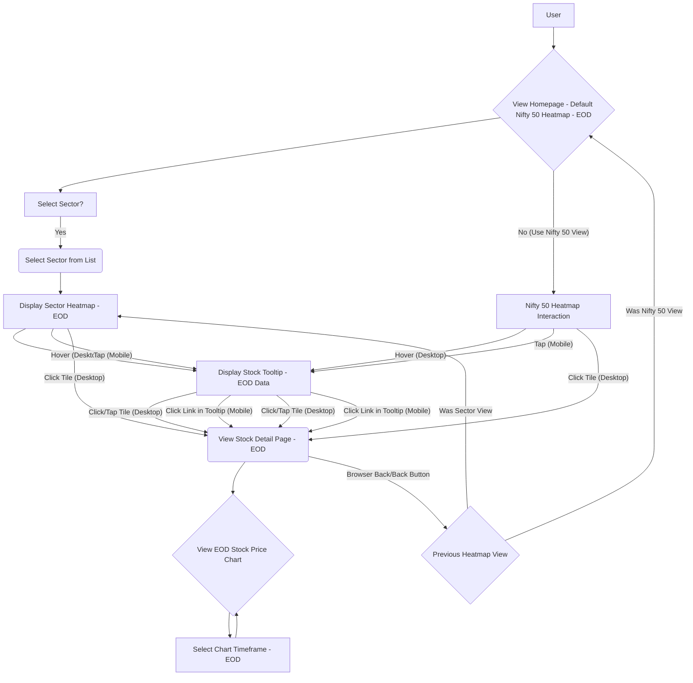

# Product Requirements Document: Visual Market Pulse Dashboard (Frontend) - v1.6

**Version:** 1.6
**Date:** 2025-05-09
**Status:** Updated Draft

## 1. Introduction

This document outlines the frontend requirements for the Visual Market Pulse Dashboard, a web application designed to provide users (particularly those seeking a quick, long-term perspective) with an intuitive, visualization-driven overview of the Indian stock market. For the MVP, this includes the Nifty 50 index and key market sectors. The core philosophy emphasizes minimal text, direct interaction with visual elements, and rapid comprehension of market state and trends using End-of-Day (EOD) data. Data is sourced via backend APIs, which in turn use Yahoo Finance (`yfinance`) exclusively for **daily (1D) EOD** historical technical data. This PRD focuses exclusively on the client-side/frontend components and interactions.

### 1.1 Problem Definition & Context

The Indian stock market sees increasing participation from retail investors who often face challenges in accessing clear, actionable information and tools to navigate market complexities efficiently using EOD data. This can lead to suboptimal investment decisions and increased anxiety, especially for newer participants. Many individuals juggle trading/investing with other commitments, highlighting the need for efficient and time-saving solutions for EOD analysis. Existing solutions may be too complex, text-heavy, or not focused on providing a quick visual pulse of the market, including sector-specific EOD trends, for long-term trend assessment. Users need a dashboard that prioritizes visual clarity and rapid comprehension of End-of-Day market movements at both the index and sector levels.

### 1.2 Business Goals & Success Metrics

* **Goal 1:** Achieve 100 registered users within the first 6 months post-launch.
    * **Metric:** Number of registered users.
* **Goal 2:** Attain an average session duration of 2.5 minutes within the first 3 months (increased due to sector views).
    * **Metric:** Average session duration.
* **Goal 3:** Gather qualitative feedback from at least 20 users within the first 2 months post-launch to inform iterative development.
    * **Metric:** Number of user feedback submissions (e.g., survey responses, direct feedback).
* **Goal 4 (User Adoption):** 50 users actively use the heatmap feature (overall and/or sector-specific) at least once a week within the first 3 months.
    * **Metric:** Weekly active users of heatmap features.
* **Goal 5 (Sector Feature Adoption):** At least 30% of active users engage with the sector selection feature within the first 3 months.
    * **Metric:** Percentage of weekly active users using the sector view.

### 1.3 User Research & Insights

While formal user research is planned for future iterations, initial assumptions are based on the understanding that Indian traders and investors, particularly those with a long-term perspective, need:
* A quick and digestible overview of daily market performance (EOD).
* The ability to understand EOD performance at a **sector level** to identify broader trends or isolated sector movements.
* Tools for basic portfolio tracking and monitoring stocks of interest using EOD data (Note: portfolio tracking is out of MVP scope, watchlist is future).
* Clear visualization of historical EOD trends to contextualize daily movements.
* Visual cues (like color intensity and size) that immediately convey the magnitude and significance of EOD changes without requiring detailed reading.

*Target User Persona (Initial):*
* **Name:** Priya Sharma
* **Age:** 30-45
* **Occupation:** Salaried Professional
* **Investing Style:** Long-term investor, primarily in blue-chip stocks and index funds, with some interest in sector-specific ETFs or stocks.
* **Needs:** Wants a quick way to check EOD market status, including which sectors are performing well or poorly, without sifting through complex charts or news. Interested in identifying major EOD movements in key indices and sectors. Values visual summaries that save time.
* **Pain Points:** Finds most financial platforms overwhelming. Doesn't have time for in-depth daily analysis but wants to stay informed about EOD trends at market and sector levels. Struggles to quickly identify significant EOD movers and sector performance from text-heavy data tables.

## 2. Goals (Product Specific)

* Provide a highly scannable (< 30 seconds for initial overview), visual overview of market health (Nifty 50) and **key market sector EOD performance**.
* Enable intuitive drill-down into specific indices, **sectors**, and individual stocks through direct interaction with visualizations, based on **EOD data**.
* Deliver a clean, minimalist, and responsive user experience across desktop and mobile devices using **Alpine.js and Bootstrap**.
* Ensure rapid comprehension of stock/index/sector EOD performance through consistent color-coding (red/green) based on a defined **linear intensity mapping**.
* Allow quick assessment of historical price trends via neutral-colored line charts displaying **EOD data since the stock's listing**.
* Enable quick assessment of EOD performance across different market sectors.
* Ensure that the visual representation of EOD data (color, size, chart) is immediately understandable and requires minimal cognitive load.

## 3. MVP Scope Definition

### 3.1 Core Functionality (MVP)

* **FEAT-001: Homepage Market/Index Heatmap (EOD Data)**
    * **User Story:** As a long-term investor, I want to see a visual grid of Nifty 50 stocks (default view), color-coded by their daily EOD percentage change and sized by market capitalization, so that I can quickly assess the overall market sentiment and identify significant EOD movers.
* **FEAT-015: Sector Selection & Heatmap View (EOD Data)**
    * **User Story:** As a long-term investor, I want to select a market sector (e.g., Nifty Bank, Nifty IT) and view a heatmap of its constituent stocks based on their EOD performance and market cap, so that I can understand which sectors are driving market movements and identify EOD performing stocks within a specific sector.
* **FEAT-002: Stock Tile Tooltip & Basic Info (EOD Data)**
    * **User Story:** As a user scanning a heatmap (market or sector), I want to hover/tap on a stock tile to see its name, daily EOD percentage change, and daily EOD volume change, so that I can get quick details without navigating away. On mobile, I want a clear way to then navigate to the detail page from the tooltip.
* **FEAT-003: Stock Detail Page View (EOD Data)**
    * **User Story:** As a user interested in a specific stock (from market or sector heatmap), I want to click/tap on its heatmap tile (or a link from the mobile tooltip) to view a dedicated page with its basic EOD price information and an EOD historical price chart, so that I can analyze its performance in more detail.
* **FEAT-004: Stock Price Chart (EOD Historical Data)**
    * **User Story:** As a user on the stock detail page, I want to see a neutral-colored line chart showing the stock's EOD price trend, so that I can understand its historical performance context. The chart should clearly represent the daily EOD price movement for the selected timeframe.
* **FEAT-005: Chart Timeframe Selection (EOD Data)**
    * **User Story:** As a user analyzing a stock chart, I want to select different EOD timeframes (1D, 5D, 1M, 6M, 1Y, Max since listing), so that I can view its EOD price trend over various periods.
* **FEAT-010: Responsive Design (Alpine.js & Bootstrap)**
    * **User Story:** As a user, I want the dashboard to be easily viewable and usable on my desktop or mobile device, so that I can check market and sector EOD data conveniently.
* **FEAT-011: Consistent Color Coding (EOD Data)**
    * **User Story:** As a user, I want to instantly understand if an EOD stock movement (in any heatmap) is positive or negative and its relative magnitude through consistent red/green color coding with varying intensity, so that I can quickly interpret the visualizations. I also want a legend to understand the color scale.
* **FEAT-012: Minimalist Navigation**
    * **User Story:** As a user, I want to easily navigate back from a detail page to the main heatmap (market or sector view), so that I can continue exploring the market.

**Basic User Flow Diagram (MVP):**

### 3.2 Scope Boundaries

**OUT of Scope for MVP:**
* Real-time data or intraday chart updates.
* User accounts or authentication.
* Portfolio tracking.
* Watchlist functionality.
* News integration.
* Advanced charting features (e.g., technical indicators, candlestick charts beyond line charts).
* Nifty Next 50 integration (Release 2).
* Index Detail Pages showing Top Gainers/Losers (Release 2).
* Overall Index Indicators on Homepage (Release 3).
* Heatmap showing aggregated sector performance (MVP shows stocks *within* a sector, not sector-level aggregate tiles).
* Complex layout algorithms beyond basic market cap weighting within the current view.
* Handling of corporate actions (splits, dividends) in historical EOD data display (rely on yfinance output).

### 3.3 MVP Validation Approach
* **Method:** Soft launch to a small group of target users.
* **Feedback:** Collect feedback via online surveys and short user interviews, specifically asking about the utility of sector views and the clarity of visual cues (color, size, chart representation of EOD data).
* **Criteria for Moving Beyond MVP:**
    * Positive qualitative feedback on ease of use for EOD data assessment (market and sector) and the effectiveness of visual cues (color, size) for rapid understanding.
    * Demonstrated understanding of heatmap and color-coding for EOD data.
    * Successful completion of core user flows (including sector selection and drill-down to stock detail) by test users.
    * Acceptable performance metrics (NFR-01) observed during testing.
* **Learning Goals:**
    * Validate the utility of the EOD visual heatmap for quick market and sector assessment.
    * Understand if the EOD historical chart meets basic analysis needs.
    * Identify any major usability issues with the EOD data presentation, sector navigation, and mobile interactions (especially tooltips and navigation).
    * Gauge interest in more detailed sector analytics for future releases.
    * Assess the effectiveness of the chosen color gradient and market cap sizing for visual interpretation.
    * Identify any performance bottlenecks related to data fetching or frontend rendering, particularly for heatmaps and historical charts.

## 4. Functional Requirements (Mapped to Features)

Features are prefixed with "FEAT-". Functional Requirements are prefixed with "FR-".

**FEAT-001: Homepage Market/Index Heatmap (EOD Data)**
* **FR-1.1:** By default, display a grid representing stocks from Nifty 50 when the user first visits the page or selects an "Overall Market" view.
* **FR-1.3:** Each stock shall be represented by a rectangular tile.
* **FR-1.4:** Tile size must be weighted proportionally by the stock's Market Capitalization relative to other stocks currently displayed in the heatmap view.
* **FR-1.5:** Tile background color must be determined by the stock's Daily Percentage Change (EOD) (fetched from API).
Definition: Daily Percentage Change = ((Current Day Close Price - Previous Day Close Price) / Previous Day Close Price) * 100%. Data reflects End-of-Day (EOD) values.
Color mapping follows FR-11.3 using a linear gradient scale.
* **FR-1.6:** Clicking/tapping a stock tile must navigate the user to the corresponding Stock Detail Page (FEAT-003).
* **FR-1.7:** Display the stock's ticker symbol clearly on the tile. For smaller tiles, the symbol may be truncated or omitted if space is insufficient, but the tooltip (FEAT-002) must always provide the full name.
Acceptance Criteria:
    * Given a user navigates to the homepage, then a heatmap of Nifty 50 stocks is displayed by default.
    * Given the Nifty 50 heatmap is displayed, then each tile's size visually corresponds to its market cap relative to other tiles in the Nifty 50.
    * Given the Nifty 50 heatmap is displayed, then each tile's color reflects its EOD daily percentage change according to the defined red/green linear scale.
    * Given the Nifty 50 heatmap is displayed, then the stock ticker symbol is visible on each tile where space allows.
    * When a user clicks a Nifty 50 stock tile, then they are navigated to that stock's detail page.
    * For tiles below a certain size threshold, the ticker symbol may be omitted. The tooltip (FEAT-002) will always display the ticker symbol.

**FEAT-015: Sector Selection & Heatmap View (EOD Data)**
* **FR-15.1:** Display a mechanism for sector selection (e.g., a dropdown list, a series of buttons) prominently on the page, likely near the main heatmap area. The list of sectors will be provided by the backend (e.g., Nifty Bank, Nifty IT, Nifty Auto, Nifty FMCG, Nifty Pharma - specific list TBD by backend).
* **FR-15.2:** The sector selection mechanism must include an option to view the "Overall Market" (i.e., Nifty 50, as per FEAT-001), which is the default view.
* **FR-15.3:** Upon selecting a sector, the main heatmap area must update to display only the constituent stocks of that selected sector.
* **FR-15.4:** Stocks within the sector-specific heatmap must adhere to the following display rules:
Tiles sized by market capitalization. The weighting should be relative to other stocks within that specific sector's heatmap display.
Tiles color-coded by EOD daily percentage change using the standard linear scale (FR-11.3).
Display the stock's ticker symbol clearly on the tile (FR-1.7 applies).
* **FR-15.5:** Each stock tile within the sector heatmap must provide tooltips on hover/tap as per FEAT-002.
* **FR-15.6:** Clicking/tapping a stock tile within the sector heatmap must navigate the user to the corresponding Stock Detail Page (FEAT-003).
* **FR-15.7:** The currently selected view (e.g., "Nifty 50" or "Nifty IT") should be clearly indicated to the user (e.g., heading above heatmap, highlighted selector).
* **Acceptance Criteria:**
    * Given the user is on the homepage, then a list of selectable market sectors and an "Overall Market" (Nifty 50) option is visible and functional.
    * When the user selects a specific sector (e.g., "Nifty IT"), then the heatmap updates to show only stocks belonging to "Nifty IT".
    * Given a sector heatmap is displayed, then each tile's size visually corresponds to its market cap relative to other stocks currently displayed in that sector's heatmap.
    * Given a sector heatmap is displayed, then each tile's color reflects its EOD daily percentage change according to the defined red/green linear scale.
    * Given a sector heatmap is displayed, then the stock ticker symbol is visible on each tile where space allows.
    * When a user clicks a stock tile within the sector heatmap, then they are navigated to that stock's detail page.
    * The UI clearly indicates which view (Overall Market or specific sector) is currently active.
    * For tiles below a certain size threshold, the ticker symbol may be omitted. The tooltip (FEAT-002) will always display the ticker symbol.

**FEAT-002: Stock Tile Tooltip & Basic Info (EOD Data) (Applies to tiles in both Nifty 50 and Sector heatmaps)**
* **FR-2.1:** Display the stock's ticker symbol directly on the heatmap tile (as per FR-1.7).
* **FR-2.2:** On mouse hover over a stock tile (desktop) in any active heatmap, display a tooltip.
* **FR-2.3:** On tap on a stock tile (mobile) in any active heatmap, display a tooltip. A second tap on the same tile or a designated area should trigger navigation to the detail page (FEAT-003). (Refinement from tap-and-hold for better mobile UX).
* **FR-2.4:** The tooltip must display: Stock Name, Daily Percentage Change (EOD), Daily Volume Change (EOD).
    * **Definition:** Daily Volume Change = ((Current Day Volume - Previous Day Volume) / Previous Day Volume) * 100%. Data reflects EOD values.
* **FR-2.5:** The tooltip must disappear when the mouse moves off the tile (desktop) or when the user taps outside the tooltip/tile area (mobile).
* **FR-2.6:** Tooltip data should be fetched efficiently, ideally as part of the initial heatmap data load for the current view, to avoid individual requests per hover/tap. (Refinement based on technical review).
* **Acceptance Criteria:**
    * Given any stock tile in an active heatmap, the stock's ticker symbol is visible on the tile where space permits.
    * Given a user hovers over any stock tile (desktop), then a tooltip appears showing the stock name, EOD daily % change, and EOD daily volume change.
    * Given a user taps any stock tile (mobile), then a tooltip appears showing the stock name, EOD daily % change, and EOD daily volume change.
    * Given the user moves the mouse off the tile (desktop) or taps outside the tooltip/tile area (mobile), then the tooltip disappears.
    * Given a user taps a tile (mobile) and the tooltip is displayed, a second tap on the tile navigates to the stock detail page.
    * The mobile tooltip includes a clear button or link to navigate to the stock detail page.

**FEAT-003: Stock Detail Page View (EOD Data) (Accessed from Nifty 50 or Sector heatmaps)**
* **FR-3.1:** Display the Stock Name/Symbol prominently.
* **FR-3.2:** Display basic current EOD price information (e.g., Last Traded Price (EOD), Daily Change (EOD), Daily Volume (EOD)).
* **FR-3.3:** Include the Stock Price Chart (FEAT-004).
* **FR-3.4:** Include Chart Timeframe Selection controls (FEAT-005).
* **FR-3.5:** Provide navigation back to the previous page (FEAT-012).
* **FR-3.6:** Display a loading indicator while stock detail data is being fetched.
* **FR-3.7:** Display a clear error message if stock detail data cannot be loaded.
* **Acceptance Criteria:**
    * Given a user is on a stock detail page, then the stock's name/symbol and EOD price/volume information are displayed.
    * Given a user is on a stock detail page, then an EOD price chart is visible.
    * Given a user is on a stock detail page, then timeframe selection controls for the chart are present.
    * Given a user is on a stock detail page, then a "Back" button is visible.
    * When the page is loading, a loading indicator is shown.
    * If data fetching fails, an error message is displayed.

**FEAT-004: Stock Price Chart (EOD Historical Data)**
* **FR-4.1:** Display a time-series chart representing the stock's EOD price.
* **FR-4.2:** Initial chart type: Line chart (MVP).
* **FR-4.3:** The line chart must use a single, neutral color (e.g., a theme blue, grey).
* **FR-4.4:** Chart must display EOD data corresponding to the selected timeframe (FEAT-005), starting with "1D". The "1D" view should visually represent the day's movement, ideally showing a line from the previous day's EOD close to the current day's EOD close if both data points are available. If only the current day's EOD close is available, display a single point. The "Max" timeframe must display EOD data since the stock's listing date.
* **FR-4.5:** Chart axes must be clearly labeled (Time, Price).
* **FR-4.6:** Chart must use 1 Day (EOD) granularity for data points. No intraday data will be displayed.
* **FR-4.7:** Display a loading indicator while chart data is being fetched for a new timeframe.
* **FR-4.8:** Display a clear error message if chart data cannot be loaded for a selected timeframe.
* **Acceptance Criteria:**
    * Given a stock detail page is loaded, then a neutral-colored line chart displays the stock's EOD price for the default "1D" timeframe, visually representing the day's movement or a single point as defined.
    * Given the "Max" timeframe is selected, then the chart updates to display EOD price data from the stock's listing date.
    * Chart axes (Time and Price) are clearly visible and labeled.
    * When chart data is loading after a timeframe selection, a loading indicator is shown.
    * If chart data fetching fails, an error message is displayed.

**FEAT-005: Chart Timeframe Selection (EOD Data)**
* **FR-5.1:** Display interactive controls (e.g., buttons) labeled "1D", "5D", "1M", "6M", "1Y", "Max".
* **FR-5.2:** Clicking/tapping a timeframe control must update the Stock Price Chart (FEAT-004) to display EOD data for the selected period.
* **FR-5.3:** The "1D" control must be active by default on page load (MVP). All timeframe buttons are present; their full functionality (fetching and displaying data for 5D, 1M, 6M, 1Y, Max) is part of MVP.
* **FR-5.4:** The "Max" timeframe must display EOD data since the stock's listing date as provided by the backend API.
* **Acceptance Criteria:**
    * Given the timeframe controls are visible, when a user clicks "1D", then the chart displays the EOD price for the relevant 1-day period as defined in FR-4.4.
    * When a user clicks any timeframe button (5D, 1M, 6M, 1Y, Max), then the chart updates to show the corresponding EOD historical price data.
    * The "Max" selection correctly displays data from the stock's listing date.
    * The currently selected timeframe button is visually indicated (e.g., highlighted).

**FEAT-010: Responsive Design (Alpine.js & Bootstrap)**
* **FR-10.1:** All pages must render correctly and be usable on common screen widths (e.g., mobile: 360px+, tablet: 768px+, desktop: 1024px+) using Bootstrap's grid system and responsive utilities, enhanced with Alpine.js for dynamic behaviors where necessary.
* **FR-10.2:** Layout elements (heatmaps, charts, sector selectors) must reflow or resize appropriately. Heatmap tile sizing (FR-1.4, FR-15.4) must remain visually proportional based on market cap within the current view, adapting to available screen space.
* **FR-10.3:** Interactions (click/tap targets, tooltips, selectors) must function correctly on touch and non-touch devices (FR-2.3 refinement for mobile tap).
* **FR-10.4:** Styling must be achieved primarily using Bootstrap. Custom CSS should be minimal and well-organized. Alpine.js will manage client-side interactivity and state for components not handled by server-side rendering (e.g., the active sector view, tooltip display logic).
* **Acceptance Criteria:**
    * Given a user views the application on a mobile device, then the layout adjusts for the smaller screen, all text is legible, and all features (including sector selection, heatmap interaction with tap tooltips, and chart timeframe selection) are usable.
    * Given a user views the application on a desktop, then the layout utilizes the larger screen space effectively.
    * Heatmap tile sizing remains visually proportional based on market cap relative to the current view, regardless of screen size.

**FEAT-011: Consistent Color Coding (EOD Data) (Applies to all heatmaps)**
* **FR-11.1:** All representations of positive EOD change (gain %) in heatmaps must use shades of green.
* **FR-11.2:** All representations of negative EOD change (loss %) in heatmaps must use shades of red.
* **FR-11.3:** Color intensity must indicate the magnitude of EOD change based on a linear scale mapping percentage change to a color gradient. The scale should be defined with clear endpoints (e.g., darkest red for -X%, darkest green for +Y%, neutral color for 0%). (Definition of specific gradient endpoints and neutral color TBD - See Dependency D2).
* **FR-11.4:** Neutral states (0% EOD change) should use a distinct neutral color (e.g., light grey), which will be the midpoint of the linear gradient.
* **FR-11.5:** Consider adding a simple color legend on the heatmap page to explain the color intensity scale. (Optional for MVP, but recommended for usability).
* **Acceptance Criteria:**
    * Given a stock has a positive EOD % change, then its representation (heatmap tile) is a shade of green.
    * Given a stock has a negative EOD % change, then its representation is a shade of red.
    * Given two stocks have different positive EOD % changes, then the stock with the larger change has a visibly more intense green color, as per the defined linear scale.
    * A stock with 0% EOD change is displayed in the defined neutral color.
    * The color mapping is consistently applied across all heatmaps (Nifty 50 and sectors).
    *  A color legend explaining the linear intensity scale is visible on heatmap pages.

**FEAT-012: Minimalist Navigation**
* **FR-12.1:** Implement a clear "Back" arrow/button on Stock Detail Pages (FEAT-003). Standard browser back button functionality should also be respected.
* **FR-12.2:** The "Back" button must navigate the user to the specific heatmap view they were on before clicking the stock tile (either the Nifty 50 view or the previously selected sector view).
* **Acceptance Criteria:**
    * Given a user is on a stock detail page, then a "Back" button is visible and functional.
    * When the user clicks the "Back" button, then they are navigated to the previously viewed heatmap (either Nifty 50 or the specific Sector heatmap they were on).
    * Using the browser's back button from the stock detail page achieves the same result.

## 5. Non-Functional Requirements

* **NFR-01: Performance:**
    * The application should load key EOD market data for the default (Nifty 50) heatmap within 5 seconds on a standard internet connection.
    * Switching to a sector heatmap and loading its EOD data should also be within 5 seconds.
    * Chart loading for EOD data on the Stock Detail Page should be within 3 seconds after timeframe selection.
    * Tooltip display on hover/tap should be near-instantaneous, leveraging pre-fetched data (FR-2.6).
* **NFR-02: Usability:**
    * Interface should be intuitive, requiring minimal instruction for EOD data interpretation (market and sector views).
    * Key EOD information should be scannable in under 30 seconds for an initial overview.
    * Sector selection should be easily discoverable and usable.
    * Visual cues (color, size, ticker symbol on tile) should be the primary means of rapid information conveyance.
* **NFR-03: Compatibility:**
    * Support latest stable versions of major desktop browsers: Chrome, Firefox, Safari, Edge.
    * Support latest stable versions of major mobile browsers: Chrome (Android), Safari (iOS).
* **NFR-04: Maintainability:**
    * Code should be well-commented and modular.
    * Use of Alpine.js and Bootstrap should follow best practices and established conventions (see Technical Guidance).
    * Adherence to Alpine.js and Bootstrap component patterns and state management best practices is required.
    * Flask backend code should be organized and maintainable, with clear separation of concerns (API, data fetching, caching).
    * Custom CSS should be minimal and well-structured.
* **NFR-05: Scalability (Frontend & Backend for MVP):** 
    * The frontend should efficiently handle the display of Nifty 50 stocks and typical sector sizes (e.g., up to 50 stocks per sector).
    * Backend Flask application should handle concurrent requests from an initial small user base (e.g., up to 100 concurrent users for MVP), leveraging caching to minimize repeated calls to the external data source.
* **NFR-06: Security (Frontend & Backend for MVP):** 
    * No user-specific sensitive data is stored or handled by the frontend or backend in the MVP (anonymous access).
    * All backend API calls for EOD data must use HTTPS.
    * Basic input sanitization for any parameters passed to the backend (though none are expected from user input in MVP beyond predefined selections).
    * Backend API endpoints should have basic rate limiting implemented.
    * No sensitive configuration or API keys should be exposed in the frontend code.
    * Implement Content Security Policy (CSP) headers to mitigate XSS risks.
* **NFR-07: Data Handling (EOD Data):** 
    * Display EOD data fetched from the backend API accurately.
    * Provide clear visual indication (e.g., spinners, loading messages via Bootstrap/Alpine.js components) if EOD data is loading or unavailable.
    * Implement robust error handling and display clear messages if data for a specific stock or sector is missing or cannot be loaded.
    * Display data source attribution (e.g., "Data sourced from Yahoo Finance") and disclaimers about EOD data (e.g., "Data is End-of-Day and for informational purposes only. Not financial advice.") prominently in the footer of all pages.
    * EOD data is updated once per day after market close. The dashboard should reflect the latest available EOD data.
    * The backend must implement caching for EOD data to reduce reliance on repeated calls to the external data source and improve performance.
* **NFR-08: Availability:**
    * The application should aim for high availability during Indian market hours and general waking hours, supported by the chosen cloud provider's SLA. (Target 99.5% uptime for MVP).
    * Implement basic monitoring and logging to detect and diagnose availability issues.
    * Implement basic observability including structured logging in the backend and basic metrics collection (e.g., API response times, error rates). Implement health checks for the Flask application.
* **NFR-09: Testing:**
    * NFR-09.1: Implement automated tests for critical frontend functionality.
    * NFR-09.2: Include unit tests for Alpine.js component logic where applicable.
    * NFR-09.3: Include integration tests for API calls and data display.
    * NFR-09.4: Include basic end-to-end tests for core user flows (e.g., navigating to heatmap, selecting sector, viewing stock detail).

## 6. Epic & Story Structure (High-Level for MVP)

* **Epic 1: Core EOD Market Data Display & Navigation**
    * **Goal:** Enable users to view the Nifty 50 heatmap, select sectors, view sector-specific heatmaps, and get quick stock info via tooltips, all based on EOD data.
    * **Scope:** Covers FEAT-001 (Nifty 50 Heatmap), FEAT-015 (Sector Selection & Heatmap), FEAT-002 (Stock Tooltip & Basic Info), initial parts of FEAT-010 (Responsive Design for these views), FEAT-011 (Color Coding), and basic navigation structure.
    * **Key Stories (Examples):**
        * As an investor, I want to see the Nifty 50 stocks displayed as a heatmap by default so I can get an immediate market overview using visual cues.
        * As an investor, I want to select a specific sector (e.g., "Nifty Bank") from a list so I can view a heatmap of only bank stocks to understand sector-specific EOD trends.
        * As an investor, I want the active view (Nifty 50 or selected sector) to be clearly indicated.
        * As an investor, I want stock tiles in heatmaps to be sized by market cap relative to the current view so I can understand their relative importance within that view.
        * As an investor, I want stock tiles to be color-coded by EOD % change so I can quickly see gainers and losers by color intensity.
        * As an investor, I want to see the stock ticker symbol on the heatmap tile so I can identify stocks quickly.
        * As an investor, I want to hover over (desktop) or tap (mobile) a stock tile to see its name, EOD % change, and EOD volume change without leaving the heatmap view.
        * As a user, I want to see a loading indicator while the heatmap data is being fetched.
        * As a user, I want to see an error message if heatmap data cannot be loaded.
* **Epic 2: EOD Stock Detail View & Historical Charting**
    * **Goal:** Allow users to drill down into individual stocks to view detailed EOD info and historical EOD price charts.
    * **Scope:** Covers FEAT-003 (Stock Detail Page), FEAT-004 (Stock Price Chart), FEAT-005 (Chart Timeframe Selection), parts of FEAT-010 (Responsive Design for detail page), and FEAT-012 (Back Navigation).
    * **Key Stories (Examples):**
        * As an investor, when I click a stock tile, I want to navigate to a detail page for that stock.
        * As an investor, on the stock detail page, I want to see its EOD price, EOD change, and EOD volume.
        * As an investor, I want to see a neutral-colored line chart of the stock's EOD historical price, defaulting to "1D" that visually represents the day's movement.
        * As an investor, I want to select different timeframes (1D, 5D, 1M, 6M, 1Y, Max) for the stock chart to see EOD trends over time.
        * As an investor, I want a "Back" button on the stock detail page to return to my previous heatmap view (Nifty 50 or specific sector).
        * As a user, I want to see a loading indicator while stock detail or chart data is being fetched.
        * As a user, I want to see an error message if stock detail or chart data cannot be loaded.
* **Epic 3: Foundational Setup & UI Shell**
    * **Goal:** Establish the core technical infrastructure, project setup, and basic application shell, ensuring data handling and responsiveness.
    * **Scope:** Flask backend setup, Alpine.js frontend structure, Bootstrap integration, charting library integration, build/deployment pipeline (basic), footer with disclaimers, loading/error state visuals, general responsiveness framework. Covers parts of FEAT-010 and NFRs related to Data Handling (attribution, loading states, error handling, caching).
    * **Key Stories (Examples):**
        * As a developer, I need a Flask backend capable of serving the frontend application and efficient API endpoints for EOD data, including caching.
        * As a developer, I need Alpine.js, Bootstrap, and a charting library integrated into the frontend for UI development.
        * As a user, I want to see a loading indicator when data is being fetched.
        * As a user, I want to see a clear error message if data cannot be loaded.
        * As a user, I want to see data source attribution and disclaimers in the footer.
        * As a developer, I need to ensure the application is usable on different screen sizes (desktop and mobile).

## 7. Technical Guidance - Initial Architect Prompt

For the initial MVP of the Visual Market Pulse Dashboard (EOD Data Viewer):

* **Frontend:** Alpine.js for lightweight reactivity and component-based UI development, coupled with Bootstrap 5 for responsive design and pre-styled components. A lightweight JavaScript charting library (e.g., Chart.js, Plotly.js - specific library TBD, recommend Chart.js for simplicity if sufficient) for displaying EOD historical line charts. HTMX is NOT required for MVP; tooltip data should be handled client-side using Alpine.js and data fetched with the main heatmap data.
* **Backend:** Flask (Python) for API development and serving the Alpine.js frontend.
* **Charting Library:** A lightweight JavaScript charting library compatible with Alpine.js (e.g., Chart.js) for displaying EOD historical line charts.
* **Data Source:** All market data will be EOD (End-of-Day), 1-day granularity, sourced exclusively from yfinance via the backend. No real-time data. The backend will be responsible for fetching, caching, and processing this data.
* **Hosting/Cloud Provider:** Preference for AWS or Google Cloud Platform for hosting the Flask backend. Frontend static assets should be served efficiently, ideally via a web server (like Nginx) or CDN, not directly by Flask. Static assets must be served separately from the Flask application process (e.g., via Nginx, Apache, or a cloud storage service like S3 with CloudFront).
* **Deployment:** Implement a basic but robust CI/CD pipeline for deploying the Flask application (e.g., using Docker, Gunicorn/uWSGI behind Nginx). The CI/CD pipeline should include steps for running automated tests, linting, and building artifacts (e.g., Docker image).
* **Local Development & Testing Requirements:**
    * Developers must be able to run the complete system (Flask backend, Alpine.js frontend) locally.
    * Consider a mechanism to use sample/mock EOD data for frontend development to decouple from live API calls during UI work and facilitate testing of edge cases (missing data, large swings).
* **Key Considerations for Architect:**
    * **API Design:** Design clear, efficient API endpoints that return all necessary EOD data for a given view (Nifty 50, specific sector, single stock detail, historical chart) in a single response where possible. Endpoints should be:
        * /api/market/nifty50: Fetch Nifty 50 constituents with EOD data (price, % change, volume change, market cap, ticker, name).
        * /api/sectors: Fetch a list of supported market sectors.
        * /api/sector/<sector_name>: Fetch constituent stocks for a selected sector with their EOD data (price, % change, volume change, market cap, ticker, name). Ensure this endpoint returns data only for stocks within the specified sector.
        * /api/stock/<symbol>/details: Fetch detailed EOD data for a single stock (Last Price, Daily Change, Daily Volume).
        * /api/stock/<symbol>/history?timeframe=<tf>: Fetch historical EOD price data for a single stock for specified timeframes (1D, 5D, 1M, 6M, 1Y, Max).
    * **Heatmap Logic:**
        * Ensure the weighted heatmap layout logic (market cap based sizing relative to the current view) can be efficiently implemented and rendered with Alpine.js and Bootstrap. Research lightweight layout libraries if needed.Optimize heatmap rendering performance. Explore lightweight libraries specifically for treemaps/heatmaps if pure Bootstrap/Alpine proves inefficient for dynamic sizing and coloring.
        * The linear color gradient scale for EOD % change needs to be defined and consistently applied client-side based on data from the backend.
    * **State Management:** Plan for client-side state management with Alpine.js for the currently selected view (Nifty 50 vs. a specific sector), active chart timeframe, tooltip visibility, loading states, etc. Use Alpine's $store for shared state.
    * **Data Fetching & Caching (Backend):** The Flask backend should handle interactions with yfinance. Implement robust caching (e.g., using Redis or a file-based cache) for yfinance EOD data, updating it once per day after market close. This is critical for performance and reliability (NFR-07).
    * **Error Handling:** Define how API errors and missing data will be communicated from the backend to the frontend and displayed to the user (NFR-07).
    * **Modularity:** Structure Flask routes and Alpine.js components for maintainability, following established conventions. Structure Alpine.js components with clear separation of concerns (e.g., data fetching logic separate from rendering logic).
    * **Static Asset Serving:** Configure the deployment environment to serve static frontend assets (HTML, CSS, JS) efficiently, separate from the Flask application process.

## 8. User Workflows & Journeys (Examples)

**Workflow 1: Quick Daily Market & Sector Health Check (MVP Focus)**
* **Persona Goal:** Get a < 1-minute feel for the overall market (Nifty 50) and key sector EOD directions using visual cues.
* **Steps:**
    1. User navigates to the dashboard homepage.
    2. Instantly observes the default Nifty 50 Market Heatmap (FEAT-001). Scans overall color balance and intensity to gauge sentiment. Notes market cap weighted tile sizes to identify large movers. Reads ticker symbols on tiles (FR-1.7).
    3. User spots the Sector Selection mechanism (FEAT-15.1).
    4. User selects "Nifty IT" from the sector list (FR-15.3).
    5. Heatmap updates to show only Nifty IT stocks, similarly color-coded and sized by market cap within the sector (FR-15.4). User scans this sector view, identifying strong/weak performers within IT.
    6. User may select another sector (e.g., "Nifty Bank") and observe its heatmap.
    7. User may switch back to "Overall Market" (Nifty 50) view.
* **Outcome:** User has quickly assessed the day's EOD state for the Nifty 50 and one or two key sectors, identifying general trends and visually prominent stocks.

**Workflow 2: Investigating a Stock's EOD Move (from Market or Sector View) in Long-Term Context (MVP)**
* **Persona Goal:** Understand if a stock's significant EOD movement (identified in Workflow 1) aligns with or deviates from its longer-term EOD price trend using EOD historical data.
* **Steps:**
    1. Following Workflow 1, user is viewing either the Nifty 50 heatmap or a specific Sector heatmap.
    2. User spots a tile with a particularly intense red or green color. Reads the ticker symbol on the tile (FR-1.7).
    3. User hovers over (desktop) or taps (mobile) the tile to see the tooltip with full stock name, EOD % change, and EOD volume change (FEAT-002).
    4. User clicks/taps the stock tile (FR-1.6 / FR-15.6). (On mobile, this is the second tap after the tooltip appears).
    5. User is navigated to the Stock Detail Page (FEAT-003). A loading indicator is shown (FR-3.6).
    6. User notes basic EOD price info (FR-3.2).
    7. User observes the Stock Price Chart (FEAT-004), initially showing "1D" EOD data, visually representing the day's movement (FR-4.4).
    8. User interacts with Chart Timeframe Selection (FEAT-005), clicking "6M", "1Y", or "Max". A loading indicator is shown (FR-4.7).
    9. The line chart updates to show the selected longer-term historical EOD price trend (FR-4.4).
    10. User assesses the EOD trend shape and compares it to the day's move.
    11. User clicks the "Back" button (FEAT-012) to return to the previous heatmap view (Nifty 50 or the specific sector).
* **Outcome:** User has contextualized a specific stock's EOD performance against its historical EOD trend using EOD data points.

## 9. Release Strategy & Timeline (Conceptual MVP)

* **Release 1 (MVP): Visual Market & Sector Pulse (EOD)**
    * **Focus:** Deliver the core visual market and sector scanning experience with EOD data.
    * **Timeline:** Estimated 6-8 weeks (assuming 1-2 developers for backend/frontend).
        * **Sprint 1-2 (Setup & Core Heatmap):** Flask backend setup, Alpine.js/Bootstrap frontend shell, Nifty 50 heatmap display (FEAT-001), basic color coding (FEAT-011), tooltips (FEAT-002).
        * **Sprint 3-4 (Stock Detail & Charting):** Stock Detail Page (FEAT-003), basic 1D Line Chart (FEAT-004), Timeframe Selection (FEAT-005), Back Navigation (FEAT-012).
        * **Sprint 5-6 (Sector Functionality & Responsive):** Sector Selection & Heatmap (FEAT-015), full responsiveness (FEAT-010), data loading/error states (NFR-07), footer.
        * **Sprint 7 (Testing & Polish):** Bug fixing, performance tweaks, final UI polish, deployment prep.
    * **Key Deliverables:** All features listed in section 3.1.
    * **Management Demo Value:** Functional visual market scanner showing daily EOD stock movements for Nifty 50 and selectable sectors, with intuitive color coding, market cap weighting, tooltips, and drill-down to historical EOD stock charts. Demonstrates core product concept for EOD data visualization.

* **Future Releases (Post-MVP):**
    * **Release 2: Enhanced Context & Index Views:** Nifty Next 50 integration, Index Detail Pages (Top 5 G/L), explicit breadcrumb navigation.
    * **Release 3: Market Context & Polish:** Overall Index Indicators on Homepage, performance optimizations.
    * **Further Roadmap:** Watchlist, basic portfolio features, more chart types, user accounts, etc.

## 10. Risk Management & Assumptions (RAID Log - Initial)

| Type       | ID | Description                                                                                                                               | Impact (H/M/L) | Likelihood (H/M/L) | Mitigation / Contingency                                                                                                       | Owner        |
| :--------- | :- | :---------------------------------------------------------------------------------------------------------------------------------------- | :------------- | :----------------- | :----------------------------------------------------------------------------------------------------------------------------- | :----------- |
| Risk       | R1 | yfinance API instability, rate limiting, or changes in data structure.                                                                    | H              | M                  | Backend to implement robust error handling, retries, and critical caching (NFR-07). Monitor yfinance updates. Have a plan to adapt. | BE Lead      |
| Risk       | R2 | Performance issues with rendering large heatmaps (Nifty 50) or frequent switching between sector views with Alpine.js/Bootstrap.           | M              | M                  | Optimize rendering logic. Research and potentially use a lightweight heatmap layout library. Efficient data fetching for views (single API call per view). Performance testing.     | FE Lead      |
| Risk       | R3 | Difficulty in accurately sourcing and mapping stocks to relevant Indian market sectors if yfinance doesn't provide this directly.         | M              | M                  | Backend team to research reliable sector mapping. May need a maintained mapping table. Define sector list early (Dependency D1). | BE Lead / PM |
| Risk       | R4 | Defining a linear color gradient scale (FR-11.3) that is intuitive and visually effective across various % changes might be challenging. | L              | M                  | UX/UI input needed. Iterate based on visual prototypes. Test with sample data. Define clear endpoints (Dependency D2). Consider a legend (FR-11.5). | PM / UX      |
| Risk       | R5 | Complexity in managing frontend state (active sector, loading states, tooltip visibility) using Alpine.js across different components.   | M              | L                  | Define clear Alpine.js component structure and state management pattern (e.g., $store). Prototype key interactions early.     | FE Lead      |
| Assumption | A1 | Backend can reliably provide all required EOD data points (price, %change, volume, market cap, listing date, sector constituents) from yfinance. | H              | -                  | Ongoing communication with Backend team. Define clear API contracts & timing. Verify yfinance capabilities. Backend caching is assumed to mitigate yfinance instability. | PM / BE Lead |
| Assumption | A2 | The chosen JavaScript charting library (e.g., Chart.js) will meet all requirements for line charts, timeframes, and responsiveness.     | M              | -                  | FE Lead to confirm library choice and capabilities early (Dependency D3).                                                      | FE Lead      |
| Assumption | A3 | Market capitalization data for weighting tiles is consistently available and accurate via yfinance EOD.                                  | H              | -                  | Backend to verify and ensure this data point is robustly fetched.                                                              | BE Lead      |
| Assumption | A4 | The defined linear color gradient endpoints (Dependency D2) will be visually effective for communicating magnitude of EOD change.         | L              | -                  | Requires testing with real data examples.                                                                                      | UX / PM      |
| Dependency | D1 | Finalized list of market sectors to be supported in MVP (backend to provide based on yfinance data).                                     | M              | -                  | Backend team to provide the list and API for sector data.                                                                      | BE Lead      |
| Dependency | D2 | Finalized specific color gradient endpoints (% values for darkest red/green, neutral color hex code) for FR-11.3.                       | M              | -                  | UX/UI task. Define before extensive CSS work.                                                                                  | UX / PM      |
| Dependency | D3 | Selection and approval of the specific High-Level JavaScript charting library.                                                             | M              | -                  | FE Lead to research, propose, and get approval.                                                                                | FE Lead / PM |
| Dependency | D4 | Specific text and legal requirements for Disclaimer and Data Source Attribution in the footer (NFR-07).                                   | L              | -                  | PM to finalize text, possibly with legal review if applicable.                                                                 | PM           |

## 11. Clarity & Communication - Glossary of Terms

* **Alpine.js:** A rugged, minimal JavaScript framework for composing behavior directly in your markup. Used for client-side interactivity and state management.
* **API:** Application Programming Interface.
* **Bootstrap:** A popular CSS framework for developing responsive and mobile-first websites.
* **BSE:** Bombay Stock Exchange.
* **Caching:** Storing copies of data in a temporary location to reduce the need to fetch it from the original source repeatedly, improving performance and reducing external API calls.
* **CDN:** Content Delivery Network.
* **CI/CD:** Continuous Integration/Continuous Deployment.
* **CSS:** Cascading Style Sheets.
* **EOD Data (End-of-Day Data):** Market data that is finalized after the market closes for the day. For this project, it implies 1-day granularity.
* **Flask:** A micro web framework written in Python.
* **FR:** Functional Requirement.
* **Heatmap:** A graphical representation of data where values are depicted by color. In this context, stock tiles colored by EOD % change.
* **HTMX:** A library that allows you to access modern browser features directly from HTML, rather than using JavaScript for certain dynamic updates. (Note: HTMX is no longer planned for MVP based on technical review recommendations).
* **HTTPS:** Hypertext Transfer Protocol Secure.
* **JS:** JavaScript.
* **KPI:** Key Performance Indicator.
* **Market Capitalization (Market Cap):** The total market value of a company's outstanding shares of stock. Used for weighting heatmap tile sizes.
* **MVP:** Minimum Viable Product.
* **NFR:** Non-Functional Requirement.
* **NSE:** National Stock Exchange of India.
* **PaaS:** Platform as a Service.
* **PM:** Product Manager.
* **PRD:** Product Requirements Document.
* **RAID Log:** Risk, Assumptions, Issues, Dependencies Log.
* **Sector:** A group of stocks representing a specific segment of the economy (e.g., Nifty Bank, Nifty IT). The specific list of sectors for MVP will be defined by the backend based on available data (e.g., from Nifty sectoral indices).
* **UI:** User Interface.
* **UX:** User Experience.
* **yfinance:** A Python library to fetch historical market data from Yahoo Finance.

## 12. Open Questions

* What is the definitive list of market sectors to be included in the MVP sector selection? (Dependency D1 - BE Lead to confirm based on yfinance data).
* What are the exact hex codes and percentage mapping for the linear color gradient for heatmaps? (Dependency D2 - UX/PM to define).
* Which specific JavaScript charting library will be used? (Dependency D3 - FE Lead/PM to decide).
* How should market cap weighting be precisely calculated and applied for tiles within a sector view (relative to the sector total market cap, or relative to the largest stock in the sector, etc.)? (Architect/FE Lead to decide for visual clarity and implementation feasibility).
* How will "1D" timeframe charts visually represent a single EOD data point or the day's movement? (UX/FE Lead to define - e.g. show a line from previous close to current close, or just the point if previous data is unavailable).
* What is the specific strategy for handling missing EOD data for individual stocks (e.g., display a grey tile, omit the tile, show an error)? (FE Lead/BE Lead to define).

## 13. Document History

| Version | Date       | Author      | Changes                                                                                                |
| :------ | :--------- | :---------- | :----------------------------------------------------------------------------------------------------- |
| 1.3     | 2025-05-06 | AI Agent    | Initial draft based on project brief (Visual Market Pulse Dashboard).                                    |
| 1.4     | 2025-05-08 | AI Agent    | Incorporated user feedback: Alpine.js/Flask, EOD data only, PRD deficiency fixes.                       |
| 1.5     | 2025-05-08 | AI Agent    | Added Sector-level views to MVP scope. Updated relevant sections (Goals, Scope, FRs, Epics, Tech Guide). |
| 1.6     | 2025-05-09 | AI Agent    | Incorporated comprehensive technical review feedback. Refined FRs (FEAT-002, FEAT-004, FEAT-010, FEAT-011), NFRs (NFR-01, NFR-06, NFR-07, NFR-08), Tech Guide (removed HTMX, added caching, API structure, deployment notes), RAID log (added R5), Glossary, Open Questions. Added ticker symbol to tiles (FR-1.7).|

